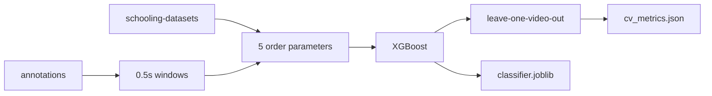

# Real-data XGBoost behavior classifier

Train and score only on the annotated trajectories in [`schooling-datasets/`](schooling-datasets/) and [`annotations/`](annotations/). Remove the Couzin simulator, behavior YAMLs, and sim-training scripts from the working path. Trajectory loading currently lives in [`src/sim/io.py`](src/sim/io.py); move the CSV reader into `src/io.py` before deleting `src/sim/`.

## Decisions

- **Samples are 0.5-second windows, not whole segments and not raw frames.** Inside each annotated interval, cut non-overlapping windows of `round(0.5 * fps)` frames (29.97 fps → 15 frames). Hop equals the window, so neighboring rows are half a second apart. A leftover shorter than 0.5 seconds is dropped. The five model inputs are the **means** of the five per-frame order parameters over that window (still 5 columns, not mean+std).
- **Twenty-five classes, one per behavior and one per directed transition.** Primary behavior names are `traveling`, `milling`, `shoaling`, `expansion`, and `compaction`. Transition names use those same words, for example `expansion_to_milling`. Change [`src/labels.py`](src/labels.py) so these are the canonical labels. Older names (`traveling_polarized`, `polarized`, `tpol`, `expansion_burst`, `burst`, `e+`, `e-`, `contraction`, and the matching transition strings) remain aliases that resolve to the short names. Do not pool transitions. Four transitions have no windows in the current annotations (`shoaling_to_milling`, `expansion_to_milling`, `expansion_to_shoaling`, `milling_to_compaction`). They stay in the label list so later videos use the same names. XGBoost is fit only on classes that have at least one window, because a class with no rows cannot be an output. Retraining after new annotations adds those classes under the same names. The saved bundle records the full 25-name list separately from the classes the current model can emit. Rough window counts for the behaviors, after aliasing: traveling ~7400, milling ~1440, shoaling ~700, compaction ~420, expansion ~160. The ~800 transition windows are split across the 16 observed transitions, and a few of those (`milling_to_shoaling`, `shoaling_to_compaction`, `milling_to_expansion`) come from a single segment. Inverse-frequency sample weights and macro-F1 are computed on classes present in the scored set. A held-out video that is the only source of a transition will show that class as missed, which is the honest leave-one-video-out result.
- **Local alignment uses a cutoff radius of 90** in the trajectory’s x,y units (pixel-scale; a 70-fish frame has median pairwise distance ~210). Neighborhood is other fish with distance strictly below 90. The focal fish is excluded.
- **Evaluation is leave-one-video-out** across the 10 dataset ids in [`annotations/datasets.json`](annotations/datasets.json). A random window split would leak the same school into train and test.

## Features

Keep the formulas already in [`src/features/order_params.py`](src/features/order_params.py). Change only `phi_local` and the degenerate-frame rules.

- `phi_trans` = magnitude of the mean unit heading.
- `phi_tan` and `phi_rad_pm` are the anisotropy-corrected correlations. Center both unit fields before the products: `r'_i = r̂_i − mean_j r̂_j` and `v'_i = v̂_i − mean_j v̂_j`, with `D = sqrt((∑ ||r'_i||²)(∑ ||v'_i||²))`. Then `phi_tan = |∑ (r'_i × v'_i)_z| / D` and `phi_rad_pm = (∑ r'_i · v'_i) / D`. Subtracting the mean radial direction removes school-shape anisotropy, and subtracting the mean heading removes the shared polarization, so an elongated school swimming one way does not by itself produce radial or tangential order.
- `phi_tan_unsigned` = fraction of centroid-relative kinetic energy in the tangential direction. Clockwise and counterclockwise both add.
- `phi_local` = mean, over fish that have at least one neighbor inside radius 90, of the magnitude of the mean unit heading of those neighbors.

Degenerate frames, written into the feature function:

- Zero speed: that fish is omitted from every average that needs a unit heading. If nobody is moving, `phi_trans` is 0 and the two centered correlations are 0.
- Fish at the centroid: omitted from the radial unit vector. It does not enter `phi_tan` or `phi_rad_pm`.
- Perfect common heading, or every fish at the centroid: the centered-correlation denominator is ~0, so `phi_tan` and `phi_rad_pm` are 0.
- No motion relative to the school mean velocity: `phi_tan_unsigned` is 0.
- No neighbor inside radius 90: that fish is skipped in `phi_local`. If that is true for every fish, `phi_local` is 0.

## Model

[`src/classify/train.py`](src/classify/train.py) becomes a real-data trainer.

- `XGBClassifier`, multiclass, `sample_weight = 1 / n_class` inside each training fold.
- Outer loop: leave one video out. Reported score is the pooled out-of-fold predictions (macro-F1, balanced accuracy, confusion matrix), not a refit on all 10 videos.
- Inside each outer fold, pick `max_depth`, `learning_rate`, and `n_estimators` by an inner leave-one-video-out on the other nine videos, scored by macro-F1. The current 245-point grid is larger than this dataset needs; use a short grid (depths 3/5/7, learning rates 0.05/0.1, 200/400 trees).
- After the outer loop, refit one model on all windows with the hyperparameter set that won the most folds, and save it as `results/classifier.joblib` together with the label encoder, the full 25-name label list, and the feature names. CV metrics go to `results/cv_metrics.json` and include support for every class, with empty classes at support 0 and left out of macro-F1. The saved model is for prediction; the CV file is the accuracy claim.
- [`src/classify/predict.py`](src/classify/predict.py) labels a new trajectory with the same 0.5-second windows and repeats each window label across its frames.

## What leaves the repo

Delete the simulator and everything that only exists to train on it:

- [`src/sim/`](src/sim/), [`src/tune/`](src/tune/), [`configs/behaviors/`](configs/behaviors/)
- [`scripts/generate_sims.py`](scripts/generate_sims.py), [`scripts/render_sims.py`](scripts/render_sims.py), [`scripts/tune_configs.py`](scripts/tune_configs.py), [`scripts/tune_features.py`](scripts/tune_features.py), [`scripts/calibrate_baselines.py`](scripts/calibrate_baselines.py)
- [`scripts/eval_real.py`](scripts/eval_real.py) folds into the new training script, since real data is no longer a separate test set

Rewrite [`README.md`](README.md) for the real-data path: features, the radius-90 rule, the 25 classes, the 0.5-second window, and leave-one-video-out. Leave [`manual eda.ipynb`](manual%20eda.ipynb) and [`annotated_features.csv`](annotated_features.csv) in place.
